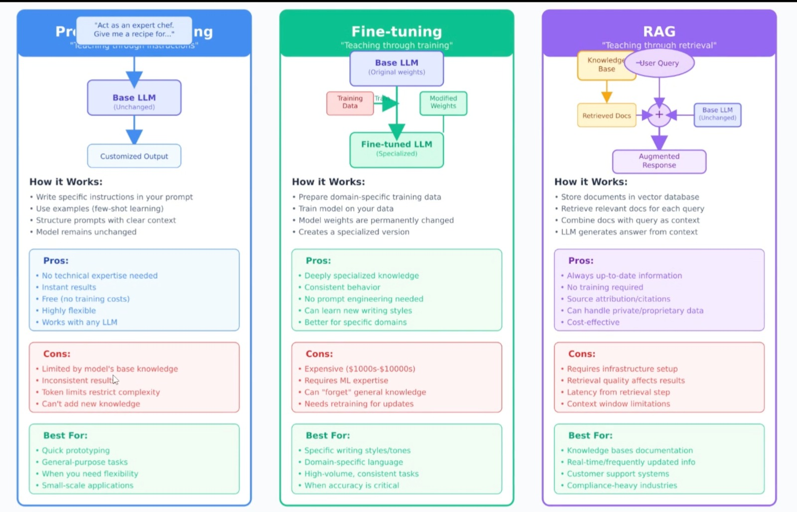
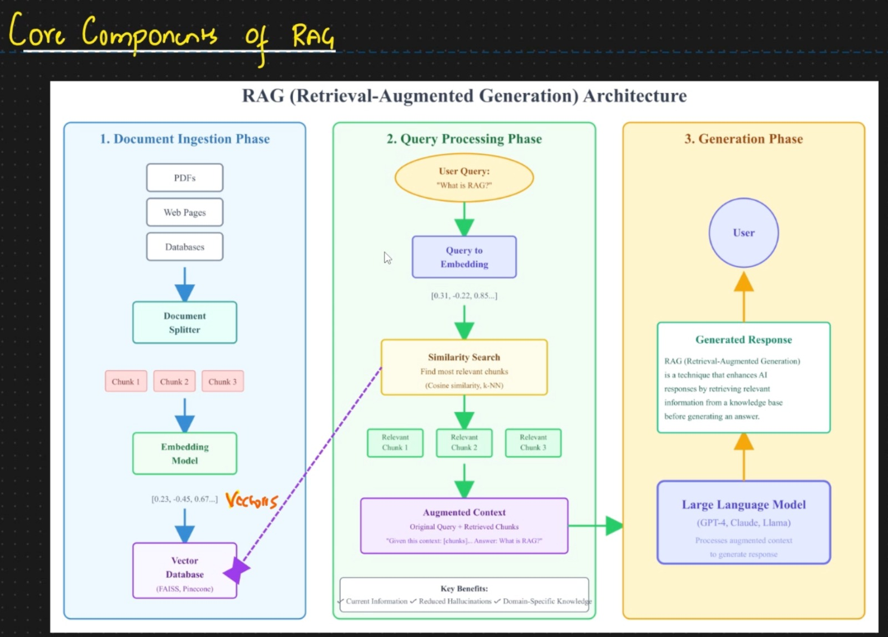
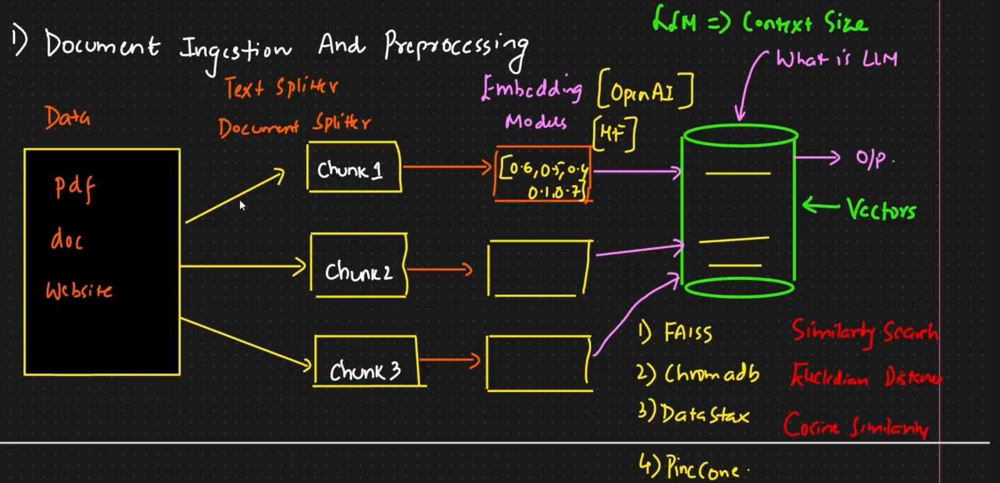
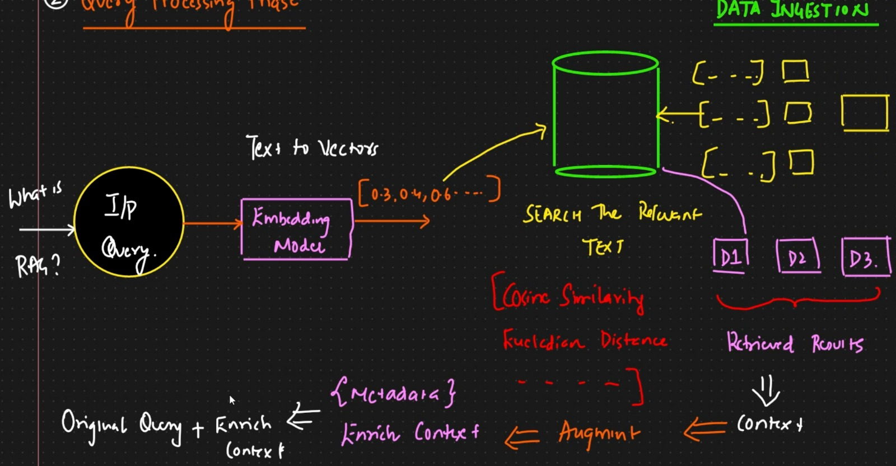

# AI Chatbot Architecture Notes

## ReAct Architecture

**ReAct** = Reasoning + Action (tool use)

---

## Retrieval-Augmented Generation (RAG)

### What is RAG?

RAG lets an LLM use external information (documents, databases, wikis, APIs) retrieved at query time to produce more accurate answers.

### RAG vs Alternatives

| Approach | Description | Pros | Cons |
|----------|-------------|------|------|
| **Prompt Engineering** | Simple prompts; no external data | Fast and simple | Limited knowledge |
| **Fine-tuning** | Train on domain data | Good for style/skills | Not suitable for fresh facts |
| **RAG** | On-demand external knowledge | Up-to-date, explainable sources | More complex setup |

### Core Components

- **Retrieval**: Fetch relevant information from a source (database, API, website)
- **Augmentation**: Enrich retrieved content with metadata (e.g., source, created date)
- **Generation**: Use the retrieved context to generate the final answer

---

## RAG Workflow Phases

    Total three phases
    1. Document Ingestion 
    2. query processing
    3. Generation Phase

### Document Ingestion and Preprocessing Phase (Pre-step)

This is the preparation phase where domain data is prepared for efficient retrieval:

- **Preprocessing**: load the data, Clean, chunk into small pieces, embed, and store as vectors
- **Storage**: Store domain data in a vector database for efficient similarity search
- **Query-time**: A retriever finds the most relevant chunks; the LLM generates an answer using search techniques (similarity search, cosine similarity, etc.)

#### Document Ingestion Steps

1. **Load the Data**: 
    - Import documents from various sources 
    - from any data source like text, word, database and excel file convert int to Documents type
    - from langchain_core.documents import Document
    - Document type will have metadata and page_content

2. **Splitting Text**: 
    Divide documents into manageable chunks (using differnt techniques Character, Recursive, Token )
    Splitting keeps chunks small, semantically meaningful, and efficient for both embedding and retrieval. In RAG, document splitting isn't optional — it's foundational.
    You split text to ensure:

    - You stay under model token limits
    - You improve retrieval accuracy
    - You minimize cost
    - You maintain semantic integrity
    
    ***Main splitting techniques:***
    1. **Character Splitter**: Split by fixed character count
    2. **Recursive Splitter**: Split by hierarchy (paragraphs → sentences → words)
    3. **Token Text Splitter**: Split based on token count for the target model
    4. **Semantic text splitting**: it's best approached based on meaning we will split
    
3. **Embedding Model**: 
    -- An embedding is a numerical representation of data — typically a vector (a list of numbers) — that captures the meaning or characteristics of that data in a way that machines can process.
    -- An embedding model is a machine learning model trained to convert input data (like text, images, or audio) into these high-dimensional numerical vectors. (embedding models will have 100+ Dimensional)
    -- An embedding model takes raw input (like text, an image, or even audio) and converts it into a dense numerical vector — a list of numbers that represents the meaning or essence of that input.
    -- Traditional keyword search only matches exact words. Embeddings allow understanding the meanings.

    -- Real-World Use Cases
        Semantic Search
            Query: “How to reset my router?”
            System finds documents with similar embeddings instead of keyword matches.
        Chatbots & QA
            - Retrieve contextually relevant information based on embedding similarity.

        Recommendation Systems
            - Suggest similar movies/products based on vector similarity.

        Anomaly Detection
            -Identify outliers in embedding spaces
            - Convert text chunks into vector representations.
    
    -- In code example i used "sentence-transformers/all-MiniLM-L6-v2" model which use 364D but if you want more acquirte the use more Dimensional.

    --see the example code for this

4. **Storage: Vecotr databse**: 
    Store embeddings in a vector database

    Vector store
    Lightweight. You can keep vectors in local memory, files, or simple tools like ChromaDB or FAISS.

    Vector database
    A full database built for vectors. Examples include Pinecone, Milvus, Weaviate, Qdrant. It handles indexing, scaling, filtering, persistence.

---

### Query Processing Phase

When a user searches for something:

1. **Convert to Vector**: The input text is converted into a vector representation
2. **Compare**: Compare with stored vectors in the database using search techniques
3. **Retrieve**: Find the most relevant information chunks
4. **Enrich**: Append retrieved content with useful metadata (source, relevance score, etc.)

---

### Generation Phase

The original query + retrieved relevant information will be sent to the LLM, which will generate the final output based on the combined context.